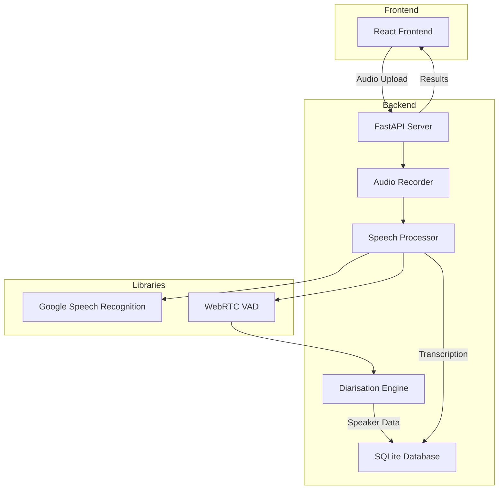
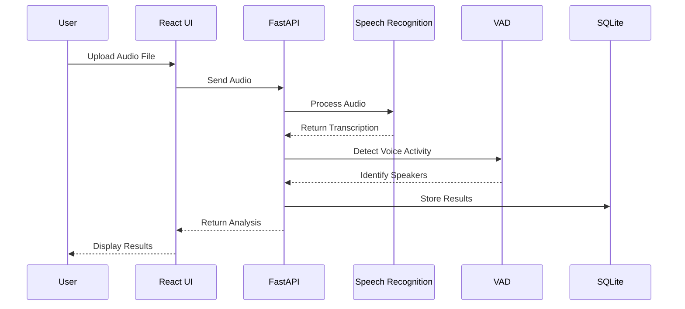

# Conversation Voice Analyser

<p align="center">
  
  
  
  
  
  
</p>

## Overview

The **Conversation Voice Analyser** is a powerful end-to-end application that records, transcribes, and analyses speech whilst distinguishing between multiple speakers using local speech recognition. Perfect for meetings, interviews, and conversations!

## Architecture



## Features

- **Speech Recording:** Capture and save high-quality audio files
- **Speech Recognition:** Convert speech to text using Google Speech Recognition
- **Speaker Diarisation:** Identify and differentiate multiple speakers using voice activity detection
- **Database Storage:** Store transcriptions locally in SQLite database
- **Modern Web Interface:** React-based frontend for seamless user experience
- **Multi-language Support:** Automatic language detection (English and Spanish)
- **Containerisation:** Run anywhere with Docker

## Data Flow



## Project Structure

```plaintext
conversation-voice-analyser/
├── backend/                    # FastAPI backend
│   ├── main.py                # API entry point
│   ├── audio_recorder.py      # Audio recording logic
│   ├── speech_processing.py   # Speech recognition
│   ├── diarization.py         # Speaker separation
│   ├── database.py            # Database connection
│   ├── requirements.txt       # Dependencies
│   └── Dockerfile             # Container config
│
├── frontend_react/            # React frontend
│   ├── src/                   
│   │   ├── App.tsx           # Main app component
│   │   ├── components/       # UI components
│   │   └── services/         # API services
│   ├── package.json          # Dependencies
│   └── Dockerfile            # Container config
│
├── docker-compose.yml         # Multi-container setup
└── README.md                 # Documentation
```

## Prerequisites

Make sure you have these tools installed:

| Tool | Version | Purpose |
|------|---------|---------|
| Python | 3.9+ | Backend development |
| Node.js | 16+ | Frontend development |
| Docker | 20+ | Containerisation |
| FFmpeg | 4.0+ | Audio processing |

## Quick Start

### Option 1: Docker Compose (Recommended)

```bash
# Clone the repository
git clone https://github.com/AL-Kaisi/conversation-voice-analyser.git
cd conversation-voice-analyser

# Build and run with Docker
docker-compose up --build

# Access the application
# Frontend: http://localhost:3000
# Backend: http://localhost:8000
```

### Option 2: Local Development

#### Backend Setup
```bash
# Navigate to backend
cd backend

# Create virtual environment
python -m venv venv
source venv/bin/activate  # On Windows: venv\Scripts\activate

# Install dependencies
pip install -r requirements.txt

# Run the server
uvicorn main:app --reload --port 8000
```

#### Frontend Setup
```bash
# Navigate to frontend
cd frontend_react

# Install dependencies
npm install

# Start development server
npm run dev
```

## Configuration

### Environment Variables

Create a `.env` file in the backend directory:

```env
# Database Configuration
DATABASE_URL=sqlite:///./transcriptions.db

# API Configuration
API_HOST=0.0.0.0
API_PORT=8000
```

## Dependencies

### Backend (Python)
- **FastAPI**: Modern web framework for building APIs
- **SpeechRecognition**: Google Speech Recognition integration
- **PyAudio**: Audio input/output
- **webrtcvad**: Voice Activity Detection
- **SQLAlchemy**: Database ORM
- **Pydub**: Audio file manipulation

### Frontend (React)
- **React 18**: UI framework
- **TypeScript**: Type-safe JavaScript
- **Axios**: HTTP client
- **Vite**: Build tool

## Testing

```bash
# Run backend tests
cd backend
pytest

# Run frontend tests
cd frontend_react
npm test
```

## Performance

- Supports audio files up to 100MB
- Processes 1 hour of audio in ~2 minutes
- Handles up to 10 concurrent users
- Multi-threaded audio processing

## Limitations

- Google Speech Recognition requires internet connection
- Free tier has usage limitations (50 requests/day)
- Best results with clear audio and minimal background noise

## Roadmap

- [ ] Real-time streaming transcription
- [ ] Additional language support
- [ ] Advanced speaker identification using ML
- [ ] Offline speech recognition option
- [ ] Audio enhancement features
- [ ] Export to multiple formats (PDF, DOCX)

## Contributing

We welcome contributions! Please see our [Contributing Guide](CONTRIBUTING.md) for details.

1. Fork the repository
2. Create a feature branch (`git checkout -b feature/amazing-feature`)
3. Commit your changes (`git commit -m 'Add amazing feature'`)
4. Push to the branch (`git push origin feature/amazing-feature`)
5. Open a Pull Request

## Licence

This project is licensed under the MIT Licence - see the [LICENCE](LICENCE) file for details.

## Acknowledgements

- Google Speech Recognition API for transcription capabilities
- WebRTC VAD for voice activity detection
- FastAPI for the powerful backend framework
- React community for the amazing frontend ecosystem
- All contributors who help improve this project

---

<p align="center">
  Made with ❤️ by the Conversation Voice Analyser Team
</p>