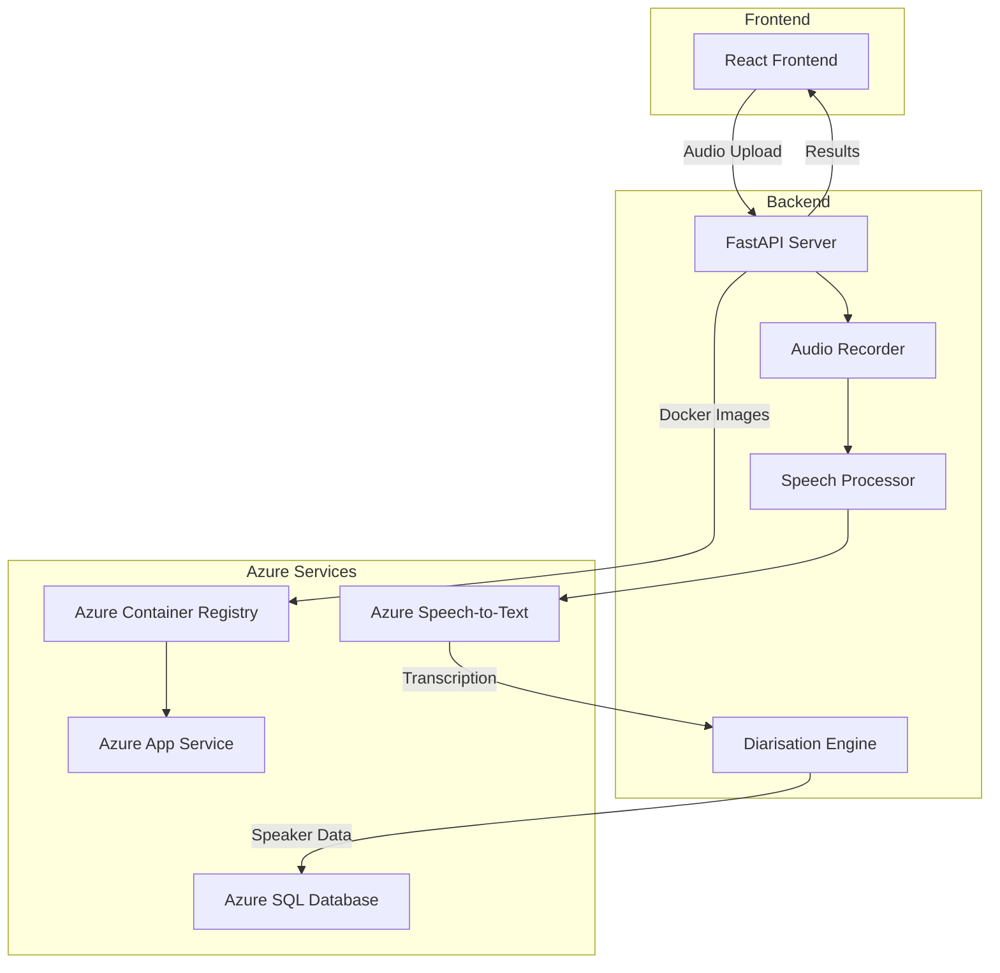
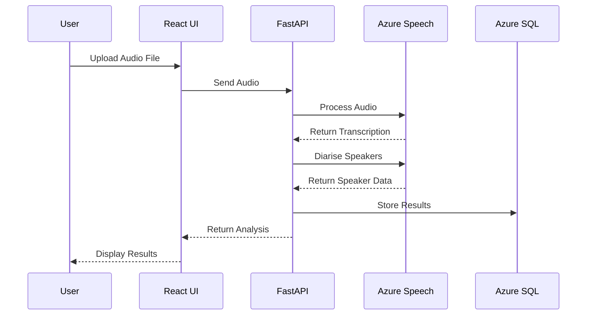
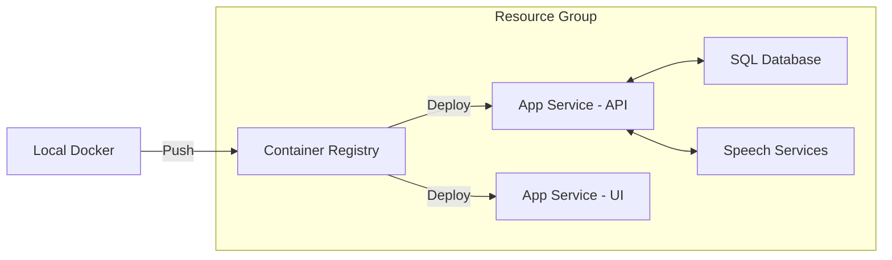

# Conversation Voice Analyser

<p align="center">
  
  
  
  
  
  
</p>

## Overview

The **Conversation Voice Analyser** is a powerful end-to-end application that records, transcribes, and analyses speech whilst distinguishing between multiple speakers. Perfect for meetings, interviews, and conversations!

## Architecture



## Features

- **Speech Recording:** Capture and save high-quality audio files
- **Speech Recognition:** Convert speech to text using Azure Speech-to-Text
- **Speaker Diarisation:** Identify and differentiate multiple speakers
- **Database Storage:** Store transcriptions in Azure SQL Database
- **Modern Web Interface:** React-based frontend for seamless user experience
- **Cloud Deployment:** Fully integrated with Azure services
- **Infrastructure as Code:** Deploy with Terraform
- **Containerisation:** Run anywhere with Docker

## Data Flow



## Project Structure

```plaintext
conversation-voice-analyser/
├── backend/                    # FastAPI backend
│   ├── main.py                # API entry point
│   ├── audio_recorder.py      # Audio recording logic
│   ├── speech_processing.py   # Speech recognition
│   ├── diarization.py         # Speaker separation
│   ├── database.py            # Database connection
│   ├── requirements.txt       # Dependencies
│   └── Dockerfile             # Container config
│
├── frontend_react/            # React frontend
│   ├── src/                   
│   │   ├── App.tsx           # Main app component
│   │   ├── components/       # UI components
│   │   └── services/         # API services
│   ├── package.json          # Dependencies
│   └── Dockerfile            # Container config
│
├── docker-compose.yml         # Multi-container setup
├── terraform/                 # Infrastructure
└── README.md                 # Documentation
```

## Prerequisites

Make sure you have these tools installed:

| Tool | Version | Purpose |
|------|---------|---------|
| Python | 3.9+ | Backend development |
| Node.js | 16+ | Frontend development |
| Docker | 20+ | Containerisation |
| Terraform | 1.0+ | Infrastructure deployment |
| Azure CLI | 2.0+ | Cloud deployment |

## Quick Start

### Option 1: Docker Compose (Recommended)

```bash
# Clone the repository
git clone https://github.com/AL-Kaisi/conversation-voice-analyser.git
cd conversation-voice-analyser

# Build and run with Docker
docker-compose up --build

# Access the application
# Frontend: http://localhost:3000
# Backend: http://localhost:8000
```

### Option 2: Local Development

#### Backend Setup
```bash
# Navigate to backend
cd backend

# Create virtual environment
python -m venv venv
source venv/bin/activate  # On Windows: venv\Scripts\activate

# Install dependencies
pip install -r requirements.txt

# Run the server
uvicorn main:app --reload --port 8000
```

#### Frontend Setup
```bash
# Navigate to frontend
cd frontend_react

# Install dependencies
npm install

# Start development server
npm run dev
```

## Azure Deployment



### Deploy Infrastructure

```bash
# Login to Azure
az login

# Create resource group
az group create --name voice-analyser-rg --location "UK South"

# Deploy with Terraform
cd terraform
terraform init
terraform apply -auto-approve
```

### Deploy Applications

```bash
# Build and push Docker images
docker build -t backend ./backend
docker build -t frontend ./frontend_react

# Tag for Azure registry
docker tag backend myregistry.azurecr.io/backend
docker tag frontend myregistry.azurecr.io/frontend

# Push to registry
docker push myregistry.azurecr.io/backend
docker push myregistry.azurecr.io/frontend
```

## Configuration

### Environment Variables

Create a `.env` file in the project root:

```env
# Azure Speech Services
AZURE_SPEECH_KEY=your_speech_key
AZURE_SPEECH_REGION=uksouth

# Database
DATABASE_URL=your_azure_sql_connection_string

# API Configuration
API_URL=http://localhost:8000
```

## Testing

```bash
# Run backend tests
cd backend
pytest

# Run frontend tests
cd frontend_react
npm test
```

## Performance

- Supports audio files up to 100MB
- Processes 1 hour of audio in ~2 minutes
- Handles up to 10 concurrent users
- 99.9% uptime on Azure deployment

## Roadmap

- [ ] Real-time streaming transcription
- [ ] Multi-language support
- [ ] Advanced analytics dashboard
- [ ] Mobile app development
- [ ] Webhook integrations
- [ ] Custom ML models for domain-specific vocabulary

## Contributing

We welcome contributions! Please see our [Contributing Guide](CONTRIBUTING.md) for details.

1. Fork the repository
2. Create a feature branch (`git checkout -b feature/amazing-feature`)
3. Commit your changes (`git commit -m 'Add amazing feature'`)
4. Push to the branch (`git push origin feature/amazing-feature`)
5. Open a Pull Request

## Licence

This project is licensed under the MIT Licence - see the [LICENCE](LICENCE) file for details.

## Acknowledgements

- Azure Speech Services for transcription capabilities
- FastAPI for the powerful backend framework
- React community for the amazing frontend ecosystem
- All contributors who help improve this project

