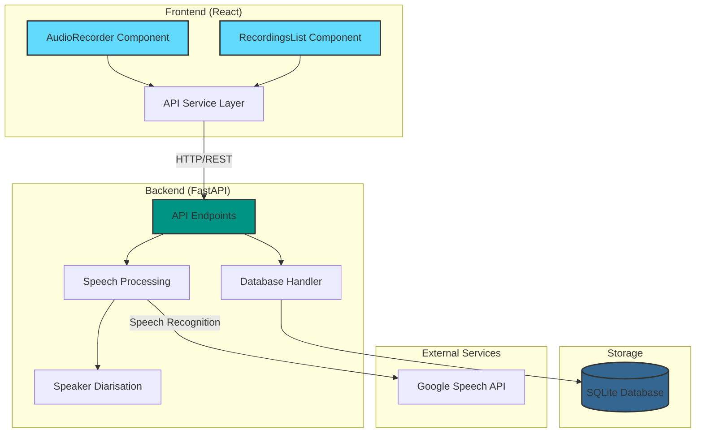
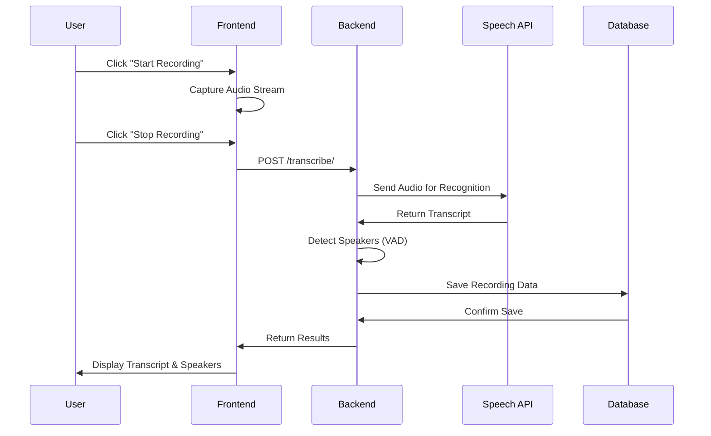
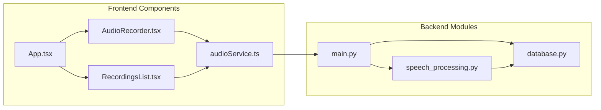
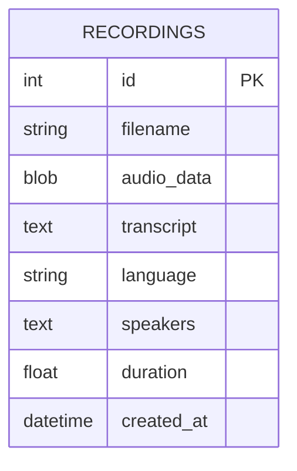
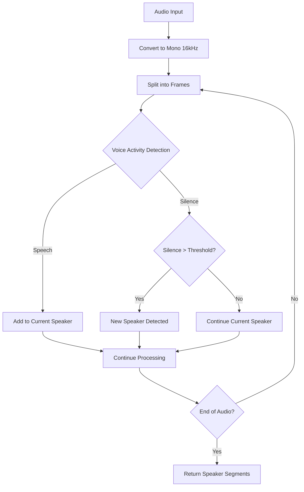
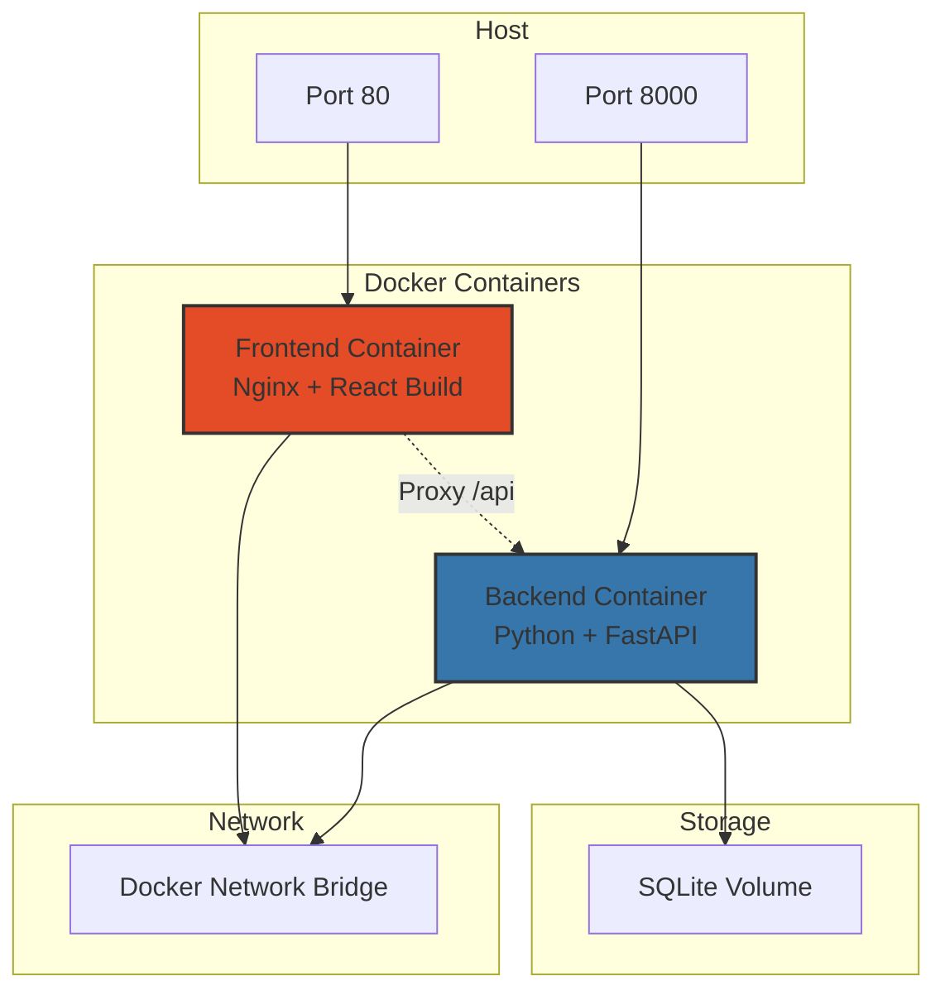
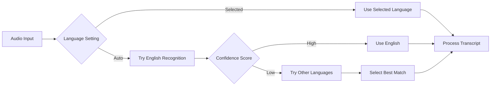
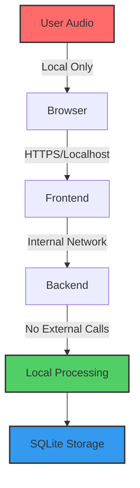

# Architecture Documentation

## System Architecture

## Data Flow Diagram

## Component Architecture

## Database Schema

## Speaker Detection Flow

## Deployment Architecture

## Language Detection Process

## Security & Privacy Flow

