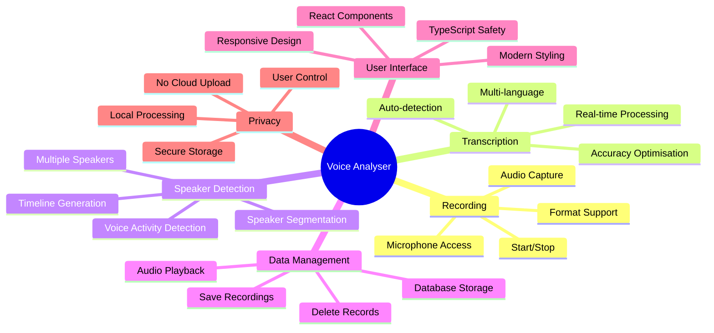
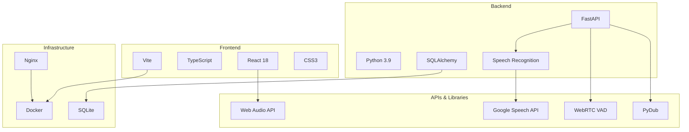
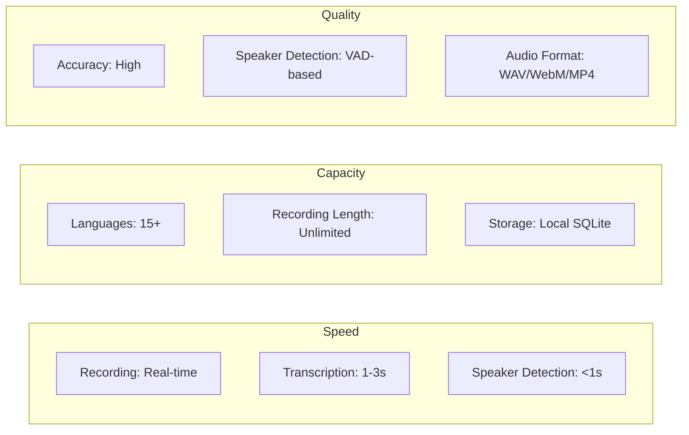
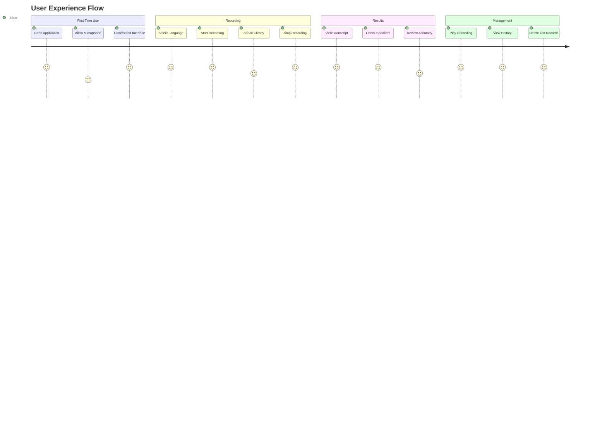
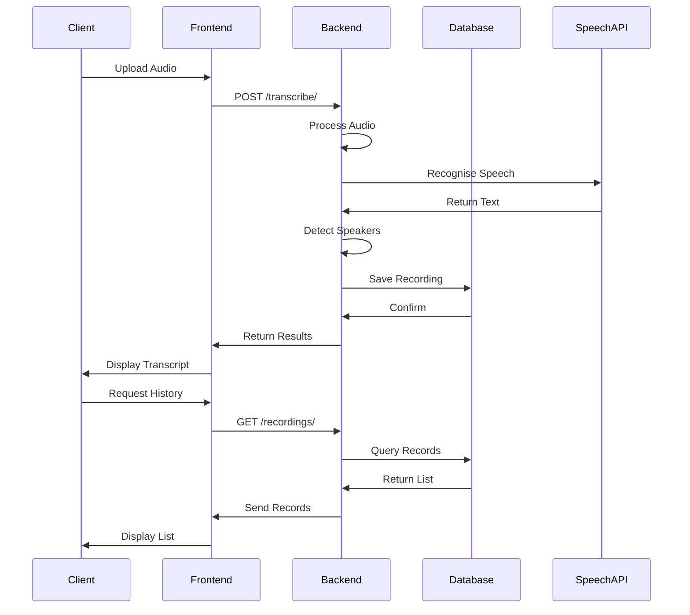
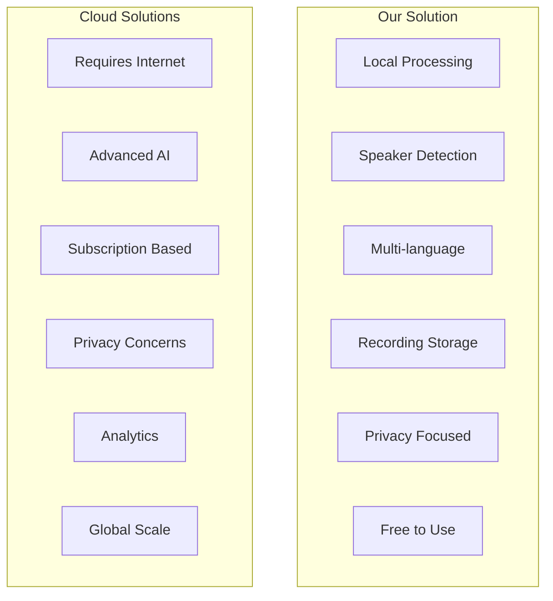
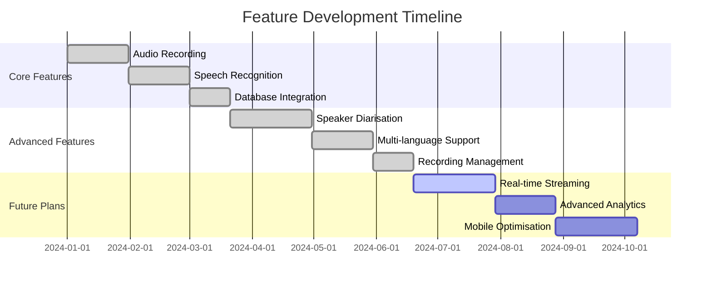

# Feature Overview

## Complete Feature Map

```mermaid
mindmap
  root((Voice Analyser))
    Recording
      Start/Stop
      Audio Capture
      Microphone Access
      Format Support
    Transcription
      Real-time Processing
      Multi-language
      Auto-detection
      Accuracy Optimisation
    Speaker Detection
      Voice Activity Detection
      Speaker Segmentation
      Timeline Generation
      Multiple Speakers
    Data Management
      Save Recordings
      Database Storage
      Audio Playback
      Delete Records
    User Interface
      React Components
      TypeScript Safety
      Responsive Design
      Modern Styling
    Privacy
      Local Processing
      No Cloud Upload
      Secure Storage
      User Control
```

## Technology Stack

```mermaid
graph TB
    subgraph "Frontend"
        A[React 18]
        B[TypeScript]
        C[Vite]
        D[CSS3]
    end
    
    subgraph "Backend"
        E[Python 3.9]
        F[FastAPI]
        G[SQLAlchemy]
        H[Speech Recognition]
    end
    
    subgraph "Infrastructure"
        I[Docker]
        J[Nginx]
        K[SQLite]
    end
    
    subgraph "APIs & Libraries"
        L[Web Audio API]
        M[Google Speech API]
        N[WebRTC VAD]
        O[PyDub]
    end
    
    A --> L
    F --> H
    H --> M
    F --> N
    F --> O
    G --> K
    C --> I
    J --> I
```

## Performance Metrics

```mermaid
graph LR
    subgraph "Speed"
        A[Recording: Real-time]
        B[Transcription: 1-3s]
        C[Speaker Detection: <1s]
    end
    
    subgraph "Capacity"
        D[Languages: 15+]
        E[Recording Length: Unlimited]
        F[Storage: Local SQLite]
    end
    
    subgraph "Quality"
        G[Accuracy: High]
        H[Speaker Detection: VAD-based]
        I[Audio Format: WAV/WebM/MP4]
    end
```

## User Journey

```mermaid
journey
    title User Experience Flow
    section First Time Use
      Open Application: 5: User
      Allow Microphone: 3: User
      Understand Interface: 5: User
    section Recording
      Select Language: 5: User
      Start Recording: 5: User
      Speak Clearly: 4: User
      Stop Recording: 5: User
    section Results
      View Transcript: 5: User
      Check Speakers: 5: User
      Review Accuracy: 4: User
    section Management
      Play Recording: 5: User
      View History: 5: User
      Delete Old Records: 5: User
```

## API Workflow

```mermaid
sequenceDiagram
    participant Client
    participant Frontend
    participant Backend
    participant Database
    participant SpeechAPI
    
    Client->>Frontend: Upload Audio
    Frontend->>Backend: POST /transcribe/
    Backend->>Backend: Process Audio
    Backend->>SpeechAPI: Recognise Speech
    SpeechAPI->>Backend: Return Text
    Backend->>Backend: Detect Speakers
    Backend->>Database: Save Recording
    Database->>Backend: Confirm
    Backend->>Frontend: Return Results
    Frontend->>Client: Display Transcript
    
    Client->>Frontend: Request History
    Frontend->>Backend: GET /recordings/
    Backend->>Database: Query Records
    Database->>Backend: Return List
    Backend->>Frontend: Send Records
    Frontend->>Client: Display List
```

## Feature Comparison

```mermaid
graph TD
    subgraph "Our Solution"
        A[Local Processing]
        B[Speaker Detection]
        C[Multi-language]
        D[Recording Storage]
        E[Privacy Focused]
        F[Free to Use]
    end
    
    subgraph "Cloud Solutions"
        G[Requires Internet]
        H[Advanced AI]
        I[Subscription Based]
        J[Privacy Concerns]
        K[Analytics]
        L[Global Scale]
    end
```

## Development Roadmap

```mermaid
gantt
    title Feature Development Timeline
    dateFormat  YYYY-MM-DD
    section Core Features
    Audio Recording           :done,    des1, 2024-01-01, 30d
    Speech Recognition       :done,    des2, after des1, 30d
    Database Integration     :done,    des3, after des2, 20d
    section Advanced Features
    Speaker Diarisation      :done,    des4, after des3, 40d
    Multi-language Support   :done,    des5, after des4, 30d
    Recording Management     :done,    des6, after des5, 20d
    section Future Plans
    Real-time Streaming      :active,  des7, after des6, 40d
    Advanced Analytics       :         des8, after des7, 30d
    Mobile Optimisation      :         des9, after des8, 40d
```