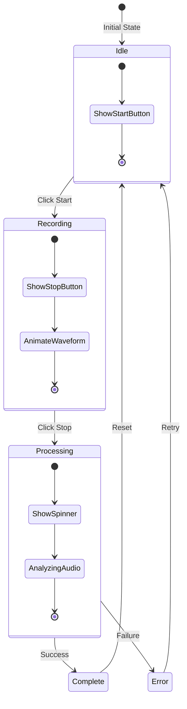
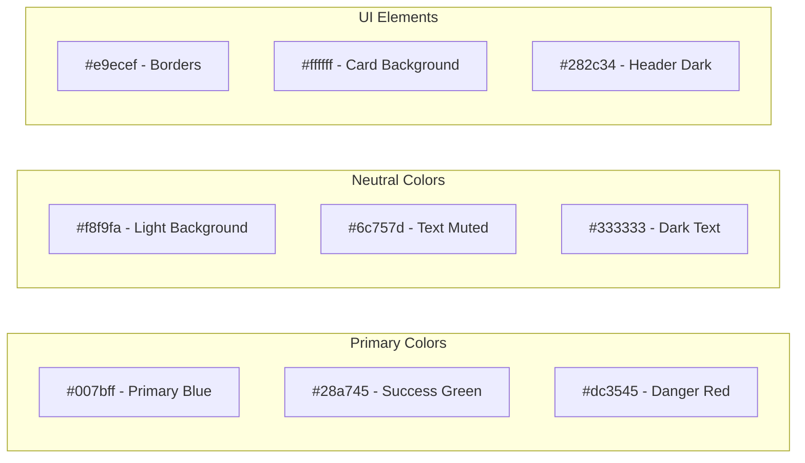
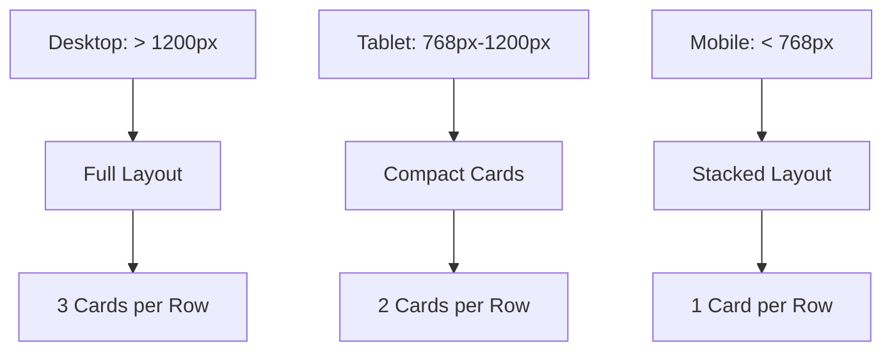

# Application Screenshots & UI Guide

## Main Interface Layout

```
┌─────────────────────────────────────────────────────┐
│          Conversation Voice Analyzer                │
├─────────────────────────────────────────────────────┤
│                                                     │
│  ┌─────────────────────────────────────────────┐  │
│  │        Voice Transcription                   │  │
│  ├─────────────────────────────────────────────┤  │
│  │                                             │  │
│  │  Language: [Auto-detect ▼]                  │  │
│  │                                             │  │
│  │     ┌─────────────────────┐                │  │
│  │     │   Start Recording    │                │  │
│  │     └─────────────────────┘                │  │
│  │                                             │  │
│  │  Transcribed Text:                          │  │
│  │  ┌─────────────────────────────────────┐   │  │
│  │  │                                     │   │  │
│  │  │  (Your transcription appears here)  │   │  │
│  │  │                                     │   │  │
│  │  └─────────────────────────────────────┘   │  │
│  │                                             │  │
│  └─────────────────────────────────────────────┘  │
│                                                     │
│  ┌─────────────────────────────────────────────┐  │
│  │         Recording History                    │  │
│  ├─────────────────────────────────────────────┤  │
│  │                                             │  │
│  │  ┌──────────────┐ ┌──────────────┐         │  │
│  │  │ Recording 1  │ │ Recording 2  │         │  │
│  │  │ EN • 2:34    │ │ ES • 1:45    │         │  │
│  │  │ 3 speakers   │ │ 2 speakers   │         │  │
│  │  │ [Play][View] │ │ [Play][View] │         │  │
│  │  └──────────────┘ └──────────────┘         │  │
│  │                                             │  │
│  └─────────────────────────────────────────────┘  │
│                                                     │
└─────────────────────────────────────────────────────┘
```

## Component States

### Recording States



### Language Selector UI

```
┌─────────────────────────────┐
│ Language: [Auto-detect ▼]   │
├─────────────────────────────┤
│ ✓ Auto-detect              │
│   English (US)             │
│   English (UK)             │
│   Spanish                  │
│   French                   │
│   German                   │
│   Italian                  │
│   Portuguese (BR)          │
│   Russian                  │
│   Japanese                 │
│   Korean                   │
│   Chinese                  │
│   Arabic                   │
│   Hindi                    │
└─────────────────────────────┘
```

### Recording Card Layout

```
┌────────────────────────────────────┐
│ recording_20240520_143022.wav   EN │
├────────────────────────────────────┤
│ Duration: 2:34    Speakers: 3      │
│ Date: 2024-05-20                   │
├────────────────────────────────────┤
│ "Hello, this is the beginning      │
│ of the transcribed conversation    │
│ between multiple speakers..."      │
├────────────────────────────────────┤
│ [Play] [Details] [Delete]          │
└────────────────────────────────────┘
```

### Modal View - Recording Details

```
┌──────────────────────────────────────────────┐
│ recording_20240520_143022.wav             X  │
├──────────────────────────────────────────────┤
│                                              │
│ Full Transcript:                             │
│ ┌──────────────────────────────────────────┐ │
│ │ This is the complete transcript of the   │ │
│ │ recorded conversation. It includes all   │ │
│ │ the words spoken by all participants...  │ │
│ └──────────────────────────────────────────┘ │
│                                              │
│ Speaker Breakdown:                           │
│ ┌──────────────────────────────────────────┐ │
│ │ Speaker 1: 0:00 - 0:45                   │ │
│ │ Speaker 2: 0:45 - 1:30                   │ │
│ │ Speaker 1: 1:30 - 2:00                   │ │
│ │ Speaker 3: 2:00 - 2:34                   │ │
│ └──────────────────────────────────────────┘ │
│                                              │
│              [ Close ]                       │
└──────────────────────────────────────────────┘
```

## UI Color Scheme



## Responsive Design Breakpoints



## Icon Reference

```
🎤 - Recording Active
⏹️ - Stop Recording
▶️ - Play Audio
🗑️ - Delete Recording
👁️ - View Details
🌐 - Language Selection
👥 - Multiple Speakers
⏱️ - Duration
📅 - Date Created
```

## Loading States

```
Recording:     [●●●●●●●●●●] Capturing audio...
Processing:    [●●●●●●●●●●] Analyzing speech...
Transcribing:  [●●●●●●●●●●] Converting to text...
Saving:        [●●●●●●●●●●] Storing recording...
```

## Error States

```
┌────────────────────────────────────────┐
│ ⚠️ Error: Microphone access denied     │
│                                        │
│ Please check your browser permissions  │
│ and allow microphone access.           │
│                                        │
│              [ OK ]                    │
└────────────────────────────────────────┘
```