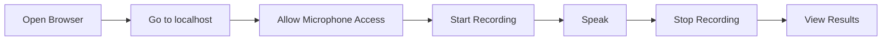
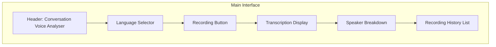
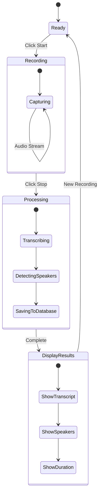
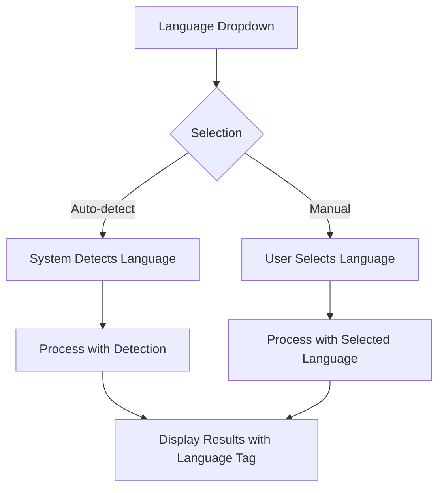
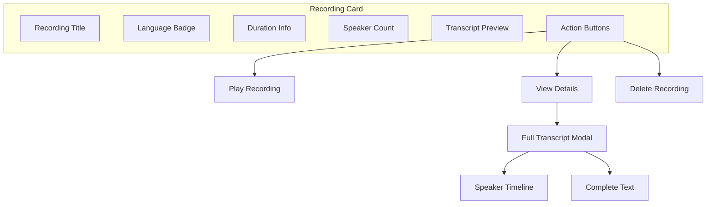
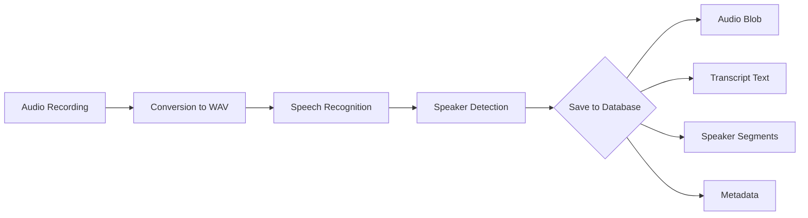
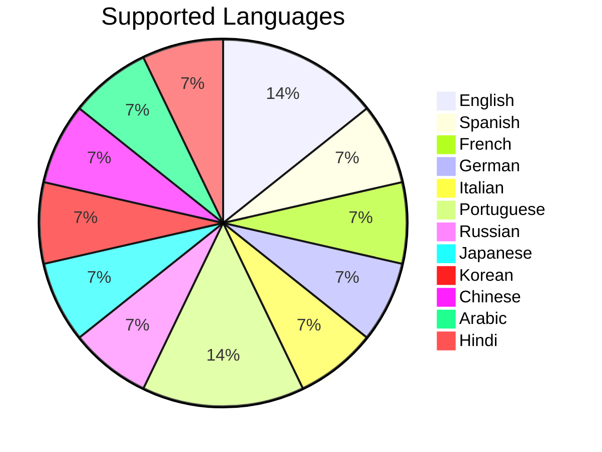
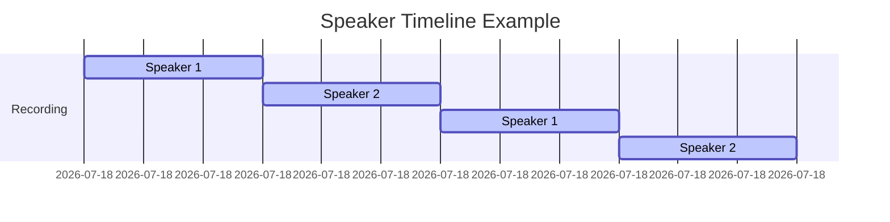
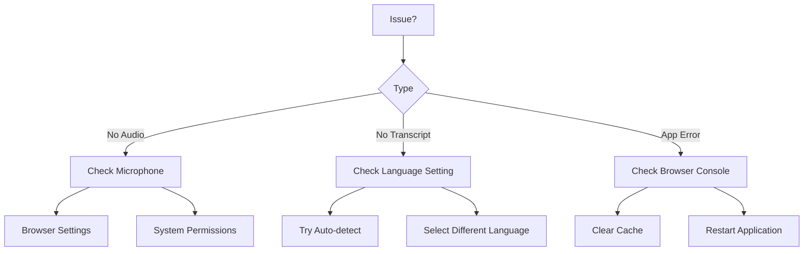

# User Guide - Conversation Voice Analyser

## Quick Start

## Interface Overview

## Recording Process

## Language Selection Flow

## Recording Management

## Data Storage

## Feature Highlights

### Multi-Language Support

### Speaker Identification

## Troubleshooting Steps

